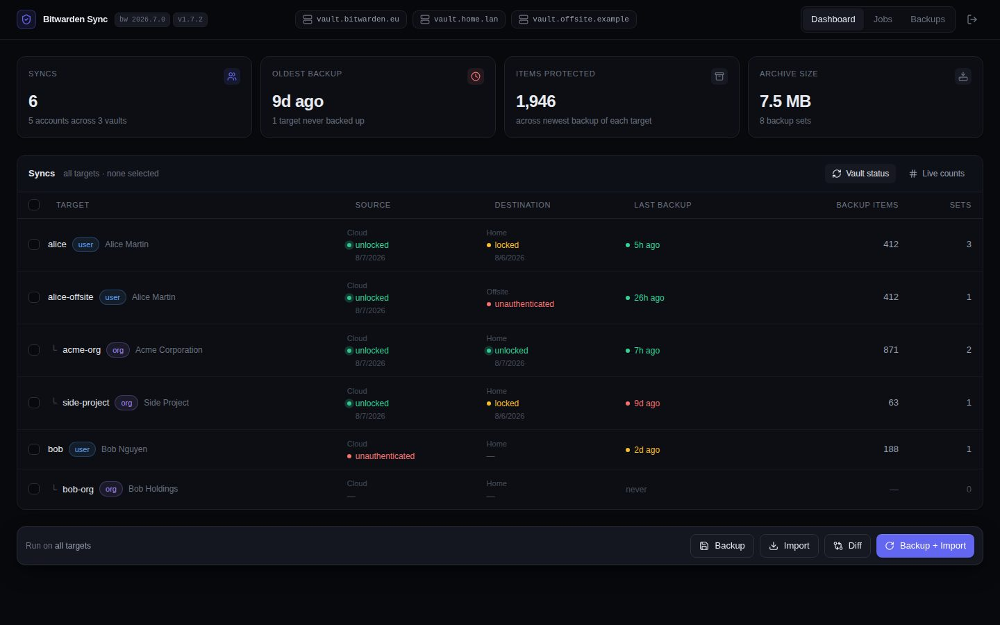
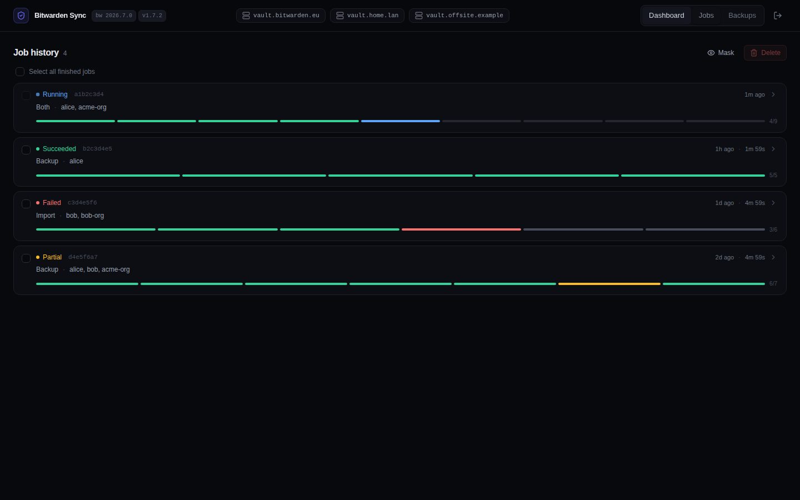
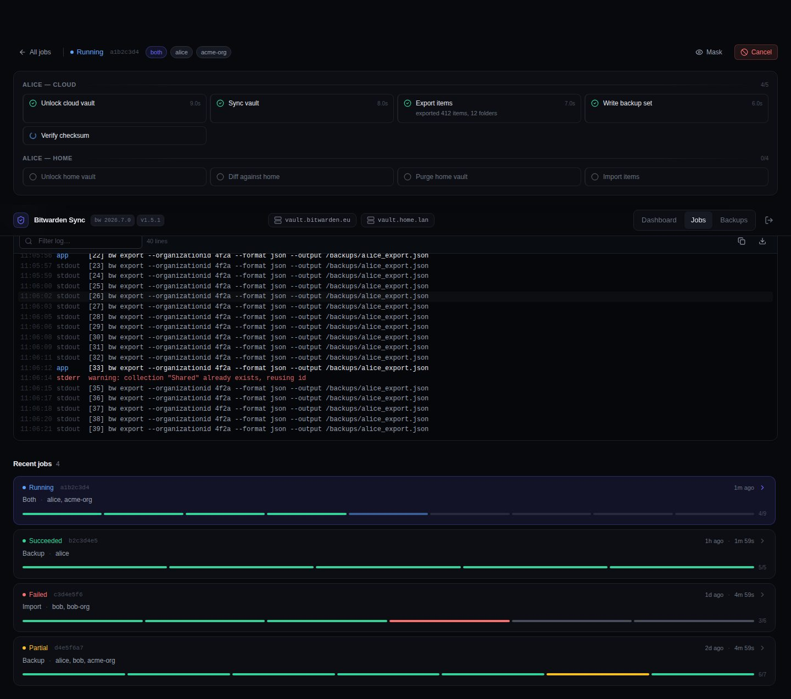
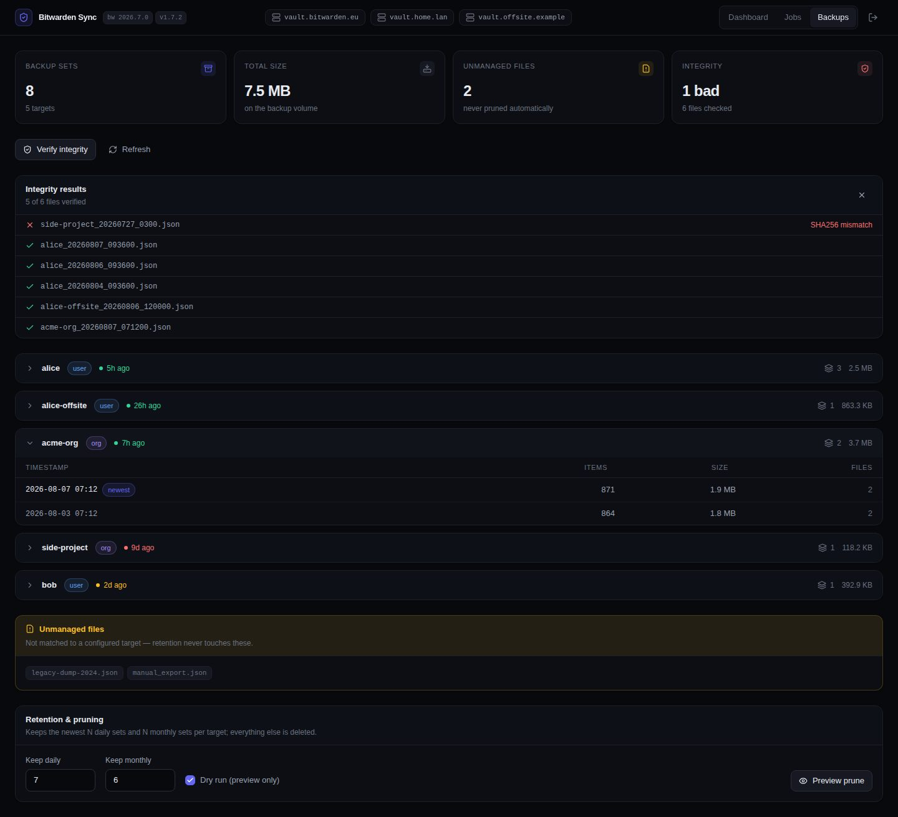

# Bitwarden Sync Web UI

[](https://github.com/vchatela-org/bitwarden-sync-webui/actions/workflows/codeql.yml)
[](https://github.com/vchatela-org/bitwarden-sync-webui/actions/workflows/ghcr-publish.yml)
[](https://github.com/vchatela-org/bitwarden-sync-webui/actions/workflows/docker-build-push.yml)
[](.github/dependabot.yml)
[](https://github.com/vchatela-org/bitwarden-sync-webui/actions/workflows/ghcr-publish.yml)

A self-hosted **web UI for syncing Bitwarden vaults between any number of Bitwarden instances**
(cloud regions, self-hosted servers, or a mix), implemented as a TypeScript/Node.js backend +
React SPA, deployed as a Docker image into a k3s cluster.

Identities are declared **per vault**, so the two sides of a sync need not share an email or a
master password, and each sync declares its own source and destination account. A single
deployment can therefore run different routes between different instance pairs at once (e.g. one
`eu → com`, another `com → selfhosted`) — see [Configuration](#configuration-targetsjson).

---

## Screenshots

Fake data — no real vault, credentials or backup ever appears here. Regenerate anytime with
`npm run screenshots` (see [scripts/screenshots.mjs](scripts/screenshots.mjs)).

<table>
<tr>
<td width="50%"><br><sub>Dashboard</sub></td>
<td width="50%"><br><sub>Job history</sub></td>
</tr>
<tr>
<td width="50%"><br><sub>Job detail</sub></td>
<td width="50%"><br><sub>Backups</sub></td>
</tr>
</table>

---

## Quick start (local development)

```bash
# 1. Install dependencies
npm install

# 2. Set required environment variables
export UI_PASSWORD=mysecretpassword
export SESSION_SECRET=$(node -e "console.log(require('crypto').randomBytes(48).toString('hex'))")
export CONFIG_PATH=./config/targets.json   # see config/targets.json.example

# 3. Start backend + Vite dev server together
npm run dev

# Server:  http://localhost:3000
# Vite:    http://localhost:5173  (proxies /api → :3000)
```

> During development the Vite dev server at `:5173` proxies `/api` to the backend at `:3000`.
> For production, the compiled SPA is served directly from the Node process.

---

## Building for production

```bash
npm run build
# Server binary: server/dist/index.js
# SPA assets:    server/dist/public/
```

---

## Running tests

```bash
npm test
```

All tests are in `server/test/`. They run with Vitest and need no network or real `bw` binary.

---

## Docker build

```bash
docker build -t bitwarden-webui:latest .
```

Override the Bitwarden CLI version:

```bash
docker build --build-arg BW_CLI_VERSION=2026.7.0 -t bitwarden-webui:latest .
```

The published image is also available at `ghcr.io/vchatela-org/bitwarden-sync-webui` (tags: `latest`
and semver versions) — see [Packages](https://github.com/vchatela-org/bitwarden-sync-webui/pkgs/container/bitwarden-sync-webui).

### Docker Compose

- `docker-compose.yml` — production stack, pulls the published GHCR image.
- `docker-compose.dev.yml` — local development stack, builds the image from source.

```bash
# Production (pulls ghcr.io/vchatela-org/bitwarden-sync-webui:latest)
docker compose up

# Development (builds from source)
docker compose -f docker-compose.dev.yml up --build
```

---

## Deploying to k3s

```bash
# 1. Create namespace
kubectl create namespace bitwarden

# 2. Edit deploy/configmap.yaml with your targets
# 3. Create real secrets (do NOT commit):
kubectl -n bitwarden create secret generic bitwarden-webui-secrets \
  --from-literal=UI_PASSWORD_HASH="$(node -e "import('argon2').then(a=>a.hash('yourpassword')).then(console.log)")" \
  --from-literal=SESSION_SECRET="$(node -e "console.log(require('crypto').randomBytes(48).toString('hex'))")"

# 4. Apply manifests
kubectl apply -k deploy/

# 5. Watch rollout
kubectl -n bitwarden rollout status deployment/bitwarden-webui
```

---

## Configuration (`targets.json`)

The config file is mounted from a ConfigMap at `CONFIG_PATH` (default `/config/targets.json`).
It has four building blocks:

| Block | What it is |
|---|---|
| `vaults` | A named Bitwarden instance (cloud region or self-hosted). |
| `accounts` | **One identity on one vault** — its own email, master password, two-step setting and CLI profile directory. The same person on two vaults is two accounts. |
| `orgs` | An organisation and its id **on each vault** it exists on. No owner: whichever account is on a route's side is the one that logs in there. |
| `syncs` | A directed `from-account → to-account` route. This is the unit everything is keyed on — the job target, the backup filename and the dashboard row. |

```jsonc
{
  "vaults": [
    // Any number of named Bitwarden instances — each account below picks one.
    { "key": "cloud", "name": "Cloud", "serverUrl": "https://vault.bitwarden.eu" },  // EU region — do NOT use bitwarden.com
    { "key": "home",  "name": "Home",  "serverUrl": "https://bitwarden.example.internal",
      "logoutAfterImport": true }                  // optional per-vault override of the global flag
  ],
  "backupFolder":   "/backups",
  "bitwardenConfigDir": "/data/bitwarden",
  "accounts": [
    // The key becomes a directory name under bitwardenConfigDir, so keep it simple.
    { "key": "val@cloud", "vault": "cloud", "email": "val@example.com", "displayName": "Val",
      "otp": "required", "otpMethod": 0 },         // 0 = authenticator, 1 = email, 3 = YubiKey
    { "key": "val@home",  "vault": "home",  "email": "val.self@example.internal", "displayName": "Val" },
    { "key": "mathou@cloud", "vault": "cloud", "email": "mathou@example.com" },
    { "key": "mathou@home",  "vault": "home",  "email": "mathou@example.com" }
  ],
  "orgs": [
    {
      "key": "org",
      "name": "My Organisation",
      "ids": {                                     // list only the vaults it actually exists on
        "cloud": "00000000-0000-0000-0000-000000000001",
        "home":  "00000000-0000-0000-0000-000000000002"
      }
    }
  ],
  "syncs": [
    { "key": "val",    "from": "val@cloud",    "to": "val@home" },
    { "key": "mathou", "from": "mathou@cloud", "to": "mathou@home" },
    { "key": "org",    "from": "val@cloud",    "to": "val@home", "org": "org" }
  ],
  "retention":  { "keepDaily": 7, "keepMonthly": 12 },
  "importGuard": { "minSourceRatio": 0.5, "blockOnEmptySource": true },
  "logoutAfterImport": true
}
```

### More than two vaults

A sync always has exactly two endpoints, so extra vaults never make the model wider — they just
add accounts and routes. One source account can feed several destinations: give each route its own
sync key (`val-home`, `val-offsite`) and each gets its own backups, dashboard row and history.

### Two-step login (`otp`)

`"otp": "required"` on an account makes the credential prompt ask for the master password **and**
the verification code in one go, instead of failing the login and prompting a second time.

Leaving it out (`"unknown"`, the default) does **not** assert that the account has no two-step
login — only that it is not recorded here, so the code is discovered the slow way and asked for in
a second prompt. The code field is never shown when the profile merely needs unlocking, since
`bw unlock` takes no code and asking would burn a single-use code for nothing.

### Reusing one password across accounts

Because accounts are separate identities, each has its own cached password. When a prompt covers
syncs whose other endpoint is a different account, it offers a *"use this password for … too"*
checkbox — so one person with the same master password on both sides still types it once. Nothing
about shared secrets is written into the config.

### Migrating a pre-1.6 `targets.json`

1.6 replaced `users[]` (one email per person, `from`/`to` vault keys) and org `owner`/`orgIds` with
`accounts[] + syncs[]`. The server detects the old shape and refuses to start with a pointer here
rather than a wall of schema errors. To convert:

1. For every `users[]` entry, create **two accounts** — one per vault it referenced — and give each
   its real email on that vault.
2. Turn each user into a sync with the same `key`, pointing `from`/`to` at those two accounts.
3. Move each org's `orgIds` to `ids`, drop its `owner`/`from`/`to`, and add a sync (again keeping the
   org's old key) whose endpoints are the accounts that own it on each side.
4. Rename `homeLogoutAfterImport` to `logoutAfterImport`.

**Keep the sync keys identical to the old user/org keys** — backup filenames are built from them,
so existing backups in `backupFolder` keep resolving and no files need renaming. Profile
directories are keyed by account instead of `<user>__<vault>`, so each account logs in once more
after the upgrade; master passwords were never on disk, so nothing is lost.

### Migrating from `.bitwarden-env`

```bash
bash scripts/env-to-json.sh /path/to/.bitwarden-env > /tmp/targets.json
# Review /tmp/targets.json, then add it to a ConfigMap
```

The script emits two accounts per user (same email on both vaults) and one sync per user/org, all
routed `cloud → home` — split the emails or repoint the routes afterwards.

---

## Generating the UI password hash

```bash
node -e "import('argon2').then(a => a.hash('your-ui-password')).then(console.log)"
```

Set the result as `UI_PASSWORD_HASH`. For development, set `UI_PASSWORD=plaintext` instead.

---

## Mounting an internal CA

If any of your self-hosted Bitwarden instances uses a certificate from an internal CA:

1. Create a ConfigMap from your CA bundle:
   ```bash
   kubectl -n bitwarden create configmap internal-ca --from-file=ca.crt=/path/to/ca.crt
   ```
2. Uncomment the `ca-bundle` volume and `NODE_EXTRA_CA_CERTS` env var in `deploy/deployment.yaml`.

`NODE_EXTRA_CA_CERTS` is inherited by the `bw` CLI child process (which is also a Node program),
so both the server's `fetch()` calls to `/ciphers/purge` and the CLI's HTTPS connections use the
same CA bundle.

---

## Backup item counts

Each backup a job produces gets a `.meta.json` sidecar recording the item, folder and collection
counts plus the SHA-256 of the password-protected export. The dashboard's **Items protected** tile
and the per-set **Items** column read from it.

Backups predating sidecars (or produced by older external tooling) have no sidecar, so the counts
fall back to the export itself. The account-key export (`*_encrypted.json`) keeps a
plain-text JSON envelope, so its `items`/`folders`/`collections` arrays can be counted without the
vault password even though every field inside them is ciphertext. `countSource` on each set says
which source was used.

The fallback reads file contents rather than just the directory listing, so results are cached in
`$DATA_DIR/backup-counts.json`, keyed on each file's size and mtime. The first `/api/backups` call
after a restart with an empty cache reads every export once (a few seconds over ~100 MB on a network
mount); later calls are served from the cache. Deleting the cache file is safe — it rebuilds.

The password-protected export (`*_encrypted_pass.json`) is a single opaque blob and yields no counts,
so a set that has lost its account-key export shows `—`.

Backups written before v1.6.2 carry a stray `.` in their filenames
(`bitwarden_export_val_20260807_122405._encrypted.json`) and did not parse, so they showed up as
**unmanaged** and had no readable counts. The server renames them on startup, rewriting the
`timestamp` and `exportFile` fields inside sidecars to match; a corrected name that is already taken
is left alone. Once renamed they are ordinary managed sets — which also means retention applies to
them, so run `/api/backups/retention` with `dryRun` first if you have a long history.

---

## Org collections on import

The import phase purges the destination before importing, and Bitwarden's purge API clears ciphers
but leaves collections standing. `bw import` never reuses a collection by name, so every collection
in the export comes back as a second, freshly-created one holding all the items, next to the emptied
original. The **Reconcile org collections** step deletes those emptied originals, leaving one
collection per name.

The consequence is that **a collection's id changes on every sync**, so group and member access
assignments bound to the old id do not survive. Orgs that manage per-collection access through
groups should re-apply it after a sync, or restrict who the sync destination org is shared with.

A superseded collection is only deleted once it has been confirmed empty. If it still holds items —
a partial purge, or a count that could not be read — it is left in place and the step reports
`needs review`.

---

## Environment variables

| Variable | Default | Description |
|---|---|---|
| `PORT` | `3000` | HTTP listen port |
| `CONFIG_PATH` | `/config/targets.json` | Path to targets.json |
| `DATA_DIR` | `/data` | Directory for CLI profiles, job history + backup count cache |
| `UI_PASSWORD_HASH` | — | Argon2id hash of the UI password (preferred) |
| `UI_PASSWORD` | — | Plaintext UI password (dev only) |
| `SESSION_SECRET` | random | Cookie signing secret — set in production |
| `LOG_LEVEL` | `info` | Log verbosity |
| `NODE_EXTRA_CA_CERTS` | — | Path to extra CA bundle (for internal TLS) |
| `TRUST_PROXY` | — | Set `1` when behind an HTTP reverse proxy |
| `BW_CLI_PINNED_VERSION` | (from Dockerfile build arg) | Asserted at boot |
| `BW_FIFO_DIR` | `/run/bw-fifo` | tmpfs directory for password FIFOs |
| `PASSWORD_TTL_MS` | `900000` | Idle TTL for cached master passwords (15 min) |

---

## Security notes

- Master passwords live **in RAM only**, never on disk, never in any env var, never in any log line.
  They reach the `bw` CLI through a FIFO (mode 0600) and are cleared when the job ends.
- The UI password is verified with Argon2id (constant-time).
- Session cookies are `HttpOnly`, `SameSite=Strict`, `Secure` (when behind TLS).
- CSRF token required on all mutating requests.
- `readOnlyRootFilesystem: true` — the only writable paths are the PVC mounts and the two `emptyDir` volumes.
- Core dumps disabled in the entrypoint (`ulimit -c 0`).
