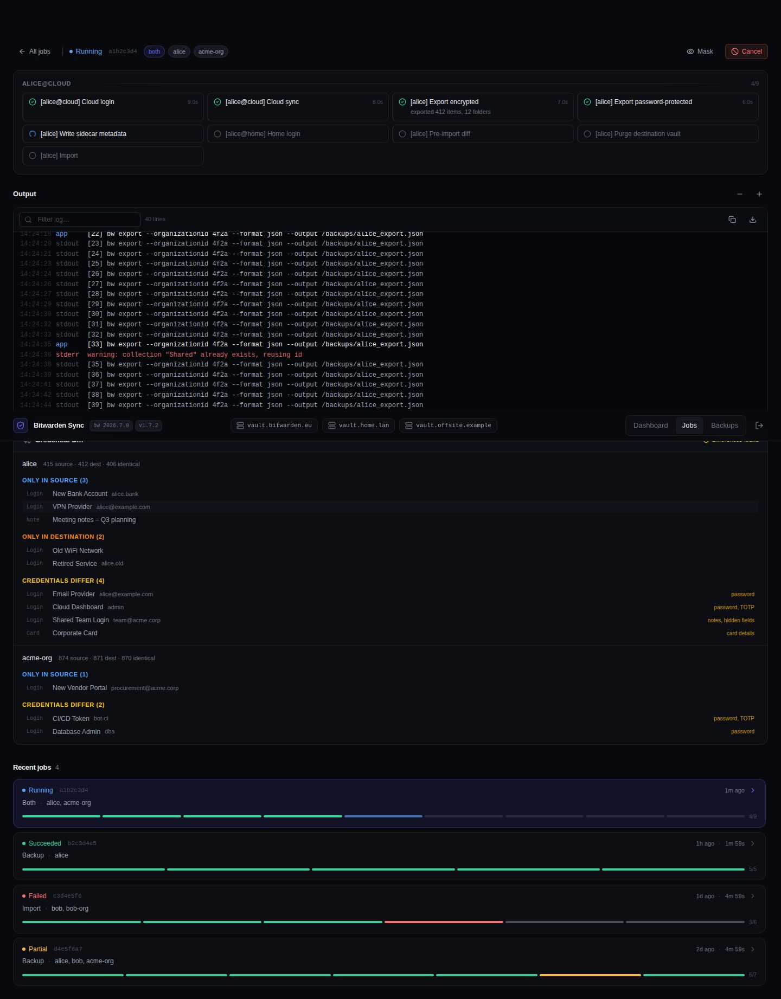

# Bitwarden Sync Web UI

[](https://github.com/vchatela-org/bitwarden-sync-webui/actions/workflows/codeql.yml)
[](https://github.com/vchatela-org/bitwarden-sync-webui/actions/workflows/ghcr-publish.yml)
[](https://github.com/vchatela-org/bitwarden-sync-webui/actions/workflows/docker-build-push.yml)
[](.github/dependabot.yml)
[](https://github.com/vchatela-org/bitwarden-sync-webui/actions/workflows/ghcr-publish.yml)

A self-hosted **web UI for syncing Bitwarden vaults between any number of Bitwarden instances**
(cloud regions, self-hosted servers, or a mix), implemented as a TypeScript/Node.js backend +
React SPA, deployed as a Docker image into a k3s cluster.

Identities are declared **per vault**, so the two sides of a sync need not share an email or a
master password, and each sync declares its own source and destination account. A single
deployment can therefore run different routes between different instance pairs at once (e.g. one
`eu → com`, another `com → selfhosted`) — see [Configuration](#configuration-targetsjson).

---

## Screenshots

Fake data — no real vault, credentials or backup ever appears here. Regenerate anytime with
`npm run screenshots` (see [scripts/screenshots.mjs](scripts/screenshots.mjs)).

<table>
<tr>
<td width="50%"><br><sub>Dashboard</sub></td>
<td width="50%"><br><sub>Job history</sub></td>
</tr>
<tr>
<td width="50%"><br><sub>Job detail</sub></td>
<td width="50%"><br><sub>Backups</sub></td>
</tr>
<tr>
<td width="50%"><br><sub>Credential diff</sub></td>
</tr>
</table>

---

## Quick start (local development)

```bash
# 1. Install dependencies
npm install

# 2. Set required environment variables
export UI_PASSWORD=mysecretpassword
export SESSION_SECRET=$(node -e "console.log(require('crypto').randomBytes(48).toString('hex'))")
export CONFIG_PATH=./config/targets.json   # see config/targets.json.example

# 3. Start backend + Vite dev server together
npm run dev

# Server:  http://localhost:3000
# Vite:    http://localhost:5173  (proxies /api → :3000)
```

> During development the Vite dev server at `:5173` proxies `/api` to the backend at `:3000`.
> For production, the compiled SPA is served directly from the Node process.

---

## Building for production

```bash
npm run build
# Server binary: server/dist/index.js
# SPA assets:    server/dist/public/
```

---

## Running tests

```bash
npm test
```

All tests are in `server/test/`. They run with Vitest and need no network or real `bw` binary.

---

## Docker build

```bash
docker build -t bitwarden-webui:latest .
```

### Bitwarden CLI version

The `bw` version baked into the image is pinned in
[`docker/bw-cli/package.json`](docker/bw-cli/package.json). That file exists only to hold the pin —
nothing is ever installed from it. The Dockerfile reads the version out of it at build time, and
Dependabot watches it as an npm manifest so a new `@bitwarden/cli` release shows up as a bump PR.
(Dependabot's docker updater only rewrites `FROM` tags, so a plain `ARG` in the Dockerfile would
never be updated.)

Keep the pin exact — no `^` or `~` — so image builds stay reproducible.

Override it for a one-off build:

```bash
docker build --build-arg BW_CLI_VERSION=2026.7.0 -t bitwarden-webui:latest .
```

Merging the Dependabot PR cuts a release on its own — see below.

### Automated release on a CLI bump

A Dependabot bump changes what the image ships without touching the app version, so on its
own nothing would ever get published. [`release-on-bw-cli-bump.yml`](.github/workflows/release-on-bw-cli-bump.yml)
closes that gap: when `docker/bw-cli/package.json` lands on `main` with a genuinely different
version, it bumps the **patch** version across the workspace (1.7.3 -> 1.7.4), runs the build and
test suite, commits, pushes an annotated `vX.Y.Z` tag, and starts the two image publishes.

It triggers on the file rather than on the `dependabot[bot]` actor, because a squash merge
does not reliably keep Dependabot as the author of the commit that reaches `main`. A hand-edit
that bumps the pin therefore releases too — an edit that only touches the manifest's
description does not.

It starts `ghcr-publish.yml` and `docker-build-push.yml` explicitly instead of letting the tag
push do it. GitHub suppresses workflow runs for events created with the default `GITHUB_TOKEN`,
so a tag pushed by CI never fires a `push: tags` trigger; `workflow_dispatch` is one of the two
documented exceptions. Giving the push step a PAT instead would let both publishers fire on
their own and make that step unnecessary.

Releases cut by hand are unaffected and still work the way they always have.

The published image is also available at `ghcr.io/vchatela-org/bitwarden-sync-webui` (tags: `latest`
and semver versions) — see [Packages](https://github.com/vchatela-org/bitwarden-sync-webui/pkgs/container/bitwarden-sync-webui).

### Docker Compose

- `docker-compose.yml` — production stack, pulls the published GHCR image.
- `docker-compose.dev.yml` — local development stack, builds the image from source.

```bash
# Production (pulls ghcr.io/vchatela-org/bitwarden-sync-webui:latest)
docker compose up

# Development (builds from source)
docker compose -f docker-compose.dev.yml up --build
```

---

## Deploying to k3s

```bash
# 1. Create namespace
kubectl create namespace bitwarden

# 2. Edit deploy/configmap.yaml with your targets
# 3. Create real secrets (do NOT commit):
kubectl -n bitwarden create secret generic bitwarden-webui-secrets \
  --from-literal=UI_PASSWORD_HASH="$(node -e "import('argon2').then(a=>a.hash('yourpassword')).then(console.log)")" \
  --from-literal=SESSION_SECRET="$(node -e "console.log(require('crypto').randomBytes(48).toString('hex'))")"

# 4. Apply manifests
kubectl apply -k deploy/

# 5. Watch rollout
kubectl -n bitwarden rollout status deployment/bitwarden-webui
```

---

## Configuration (`targets.json`)

The config file is mounted from a ConfigMap at `CONFIG_PATH` (default `/config/targets.json`).
It has four building blocks:

| Block | What it is |
|---|---|
| `vaults` | A named Bitwarden instance (cloud region or self-hosted). |
| `accounts` | **One identity on one vault** — its own email, master password, two-step setting and CLI profile directory. The same person on two vaults is two accounts. |
| `orgs` | An organisation and its id **on each vault** it exists on. No owner: whichever account is on a route's side is the one that logs in there. |
| `syncs` | A directed `from-account → to-account` route. This is the unit everything is keyed on — the job target, the backup filename and the dashboard row. |

```jsonc
{
  "vaults": [
    // Any number of named Bitwarden instances — each account below picks one.
    { "key": "cloud", "name": "Cloud", "serverUrl": "https://vault.bitwarden.eu" },  // EU region — do NOT use bitwarden.com
    { "key": "home",  "name": "Home",  "serverUrl": "https://bitwarden.example.internal",
      "logoutAfterImport": true }                  // optional per-vault override of the global flag
  ],
  "backupFolder":   "/backups",
  "bitwardenConfigDir": "/data/bitwarden",
  "accounts": [
    // The key becomes a directory name under bitwardenConfigDir, so keep it simple.
    { "key": "val@cloud", "vault": "cloud", "email": "val@example.com", "displayName": "Val",
      "otp": "required", "otpMethod": 0 },         // 0 = authenticator, 1 = email, 3 = YubiKey
    { "key": "val@home",  "vault": "home",  "email": "val.self@example.internal", "displayName": "Val" },
    { "key": "mathou@cloud", "vault": "cloud", "email": "mathou@example.com" },
    { "key": "mathou@home",  "vault": "home",  "email": "mathou@example.com" }
  ],
  "orgs": [
    {
      "key": "org",
      "name": "My Organisation",
      "ids": {                                     // list only the vaults it actually exists on
        "cloud": "00000000-0000-0000-0000-000000000001",
        "home":  "00000000-0000-0000-0000-000000000002"
      }
    }
  ],
  "syncs": [
    { "key": "val",    "from": "val@cloud",    "to": "val@home" },
    { "key": "mathou", "from": "mathou@cloud", "to": "mathou@home" },
    { "key": "org",    "from": "val@cloud",    "to": "val@home", "org": "org" }
  ],
  "retention":  { "keepDaily": 7, "keepMonthly": 12 },
  "importGuard": { "minSourceRatio": 0.5, "blockOnEmptySource": true },
  "logoutAfterImport": true
}
```

### More than two vaults

A sync always has exactly two endpoints, so extra vaults never make the model wider — they just
add accounts and routes. One source account can feed several destinations: give each route its own
sync key (`val-home`, `val-offsite`) and each gets its own backups, dashboard row and history.

### Two-step login (`otp`)

`"otp": "required"` on an account makes the credential prompt ask for the master password **and**
the verification code in one go, instead of failing the login and prompting a second time.

Leaving it out (`"unknown"`, the default) does **not** assert that the account has no two-step
login — only that it is not recorded here, so the code is discovered the slow way and asked for in
a second prompt. The code field is never shown when the profile merely needs unlocking, since
`bw unlock` takes no code and asking would burn a single-use code for nothing.

### Reusing one password across accounts

Because accounts are separate identities, each has its own cached password. When a prompt covers
syncs whose other endpoint is a different account, it offers a *"use this password for … too"*
checkbox — so one person with the same master password on both sides still types it once. Nothing
about shared secrets is written into the config.

## Generating the UI password hash

```bash
node -e "import('argon2').then(a => a.hash('your-ui-password')).then(console.log)"
```

Set the result as `UI_PASSWORD_HASH`. For development, set `UI_PASSWORD=plaintext` instead.

---

## Mounting an internal CA

If any of your self-hosted Bitwarden instances uses a certificate from an internal CA:

1. Create a ConfigMap from your CA bundle:
   ```bash
   kubectl -n bitwarden create configmap internal-ca --from-file=ca.crt=/path/to/ca.crt
   ```
2. Uncomment the `ca-bundle` volume and `NODE_EXTRA_CA_CERTS` env var in `deploy/deployment.yaml`.

`NODE_EXTRA_CA_CERTS` is inherited by the `bw` CLI child process (which is also a Node program),
so both the server's `fetch()` calls to `/ciphers/purge` and the CLI's HTTPS connections use the
same CA bundle.

---

## Backup item counts

Each backup a job produces gets a `.meta.json` sidecar recording the item, folder and collection
counts plus the SHA-256 of the password-protected export. The dashboard's **Items protected** tile
and the per-set **Items** column read from it.

Backups predating sidecars (or produced by older external tooling) have no sidecar, so the counts
fall back to the export itself. The account-key export (`*_encrypted.json`) keeps a
plain-text JSON envelope, so its `items`/`folders`/`collections` arrays can be counted without the
vault password even though every field inside them is ciphertext. `countSource` on each set says
which source was used.

The fallback reads file contents rather than just the directory listing, so results are cached in
`$DATA_DIR/backup-counts.json`, keyed on each file's size and mtime. The first `/api/backups` call
after a restart with an empty cache reads every export once (a few seconds over ~100 MB on a network
mount); later calls are served from the cache. Deleting the cache file is safe — it rebuilds.

The password-protected export (`*_encrypted_pass.json`) is a single opaque blob and yields no counts,
so a set that has lost its account-key export shows `—`.

Backups written before v1.6.2 carry a stray `.` in their filenames
(`bitwarden_export_val_20260807_122405._encrypted.json`) and did not parse, so they showed up as
**unmanaged** and had no readable counts. The server renames them on startup, rewriting the
`timestamp` and `exportFile` fields inside sidecars to match; a corrected name that is already taken
is left alone. Once renamed they are ordinary managed sets — which also means retention applies to
them, so run `/api/backups/retention` with `dryRun` first if you have a long history.

---

## Org collections on import

The import phase purges the destination before importing, and Bitwarden's purge API clears ciphers
but leaves collections standing. `bw import` never reuses a collection by name, so every collection
in the export comes back as a second, freshly-created one holding all the items, next to the emptied
original. The **Reconcile org collections** step deletes those emptied originals, leaving one
collection per name.

The consequence is that **a collection's id changes on every sync**, so group and member access
assignments bound to the old id do not survive. Orgs that manage per-collection access through
groups should re-apply it after a sync, or restrict who the sync destination org is shared with.

A superseded collection is only deleted once it has been confirmed empty. If it still holds items —
a partial purge, or a count that could not be read — it is left in place and the step reports
`needs review`.

---

## Vault diff

Every **Backup + Import** and **Import** job runs two layers of diff before touching the
destination vault:

### Pre-import guard (item-level)

Before purging the destination, the server compares source and destination **item counts**
and lists the items that would be added or removed at the name level. If the source count
drops below the configured `importGuard.minSourceRatio` (default 50%) of the destination,
or the source is empty with `blockOnEmptySource: true`, the job pauses for a manual
**proceed / skip / abort** decision.

This catches cases where the source vault was accidentally emptied, the wrong account was
unlocked, or the export was truncated — before any data is deleted.

### Credential diff (hashed)

After the import completes, a second pass compares every item in the source and destination
vaults **by credential category** — without ever exposing a single password, TOTP seed,
note body, hidden custom field, or card number. Each category is SHA-256 hashed
independently, and only the hashes are compared.

The result, shown in the job detail view, breaks down per target into:

| Section | What it means |
|---|---|
| **Only in source** | Items present in the source vault but missing from the destination after import. |
| **Only in destination** | Items in the destination that were not in the source — typically pre-existing entries the import did not touch. |
| **Credentials differ** | Items present on both sides but with at least one credential category (password, TOTP, notes, hidden fields, or card details) that differs. The specific categories that changed are listed per item. |
| **Identical** | Items whose credential hashes match exactly across all categories. |

Items are matched by `(type, name, username)` — the same identity key used by the pre-import
diff. When a vault contains **multiple entries with the same name and username** (duplicate
logins, common in shared orgs), their per-category hashes are sorted before comparison so
that listing-order differences between source and destination don't produce false positives.

The diff runs on the **Diff** button (standalone) and automatically at the end of every
**Backup + Import** and **Import** job. Standalone diff jobs unlock both vaults, compare
them, and report the results without modifying either side.

---

## Environment variables

| Variable | Default | Description |
|---|---|---|
| `PORT` | `3000` | HTTP listen port |
| `CONFIG_PATH` | `/config/targets.json` | Path to targets.json |
| `DATA_DIR` | `/data` | Directory for CLI profiles, job history + backup count cache |
| `UI_PASSWORD_HASH` | — | Argon2id hash of the UI password (preferred) |
| `UI_PASSWORD` | — | Plaintext UI password (dev only) |
| `SESSION_SECRET` | random | Cookie signing secret — set in production |
| `LOG_LEVEL` | `info` | Log verbosity |
| `NODE_EXTRA_CA_CERTS` | — | Path to extra CA bundle (for internal TLS) |
| `TRUST_PROXY` | — | Set `1` when behind an HTTP reverse proxy |
| `BW_CLI_PINNED_VERSION` | (from `docker/bw-cli/package.json`) | Asserted at boot |
| `BW_FIFO_DIR` | `/run/bw-fifo` | tmpfs directory for password FIFOs |
| `PASSWORD_TTL_MS` | `900000` | Idle TTL for cached master passwords (15 min) |

---

## Security notes

- Master passwords live **in RAM only**, never on disk, never in any env var, never in any log line.
  They reach the `bw` CLI through a FIFO (mode 0600) and are cleared when the job ends.
- The UI password is verified with Argon2id (constant-time).
- Session cookies are `HttpOnly`, `SameSite=Strict`, `Secure` (when behind TLS).
- CSRF token required on all mutating requests.
- `readOnlyRootFilesystem: true` — the only writable paths are the PVC mounts and the two `emptyDir` volumes.
- Core dumps disabled in the entrypoint (`ulimit -c 0`).
